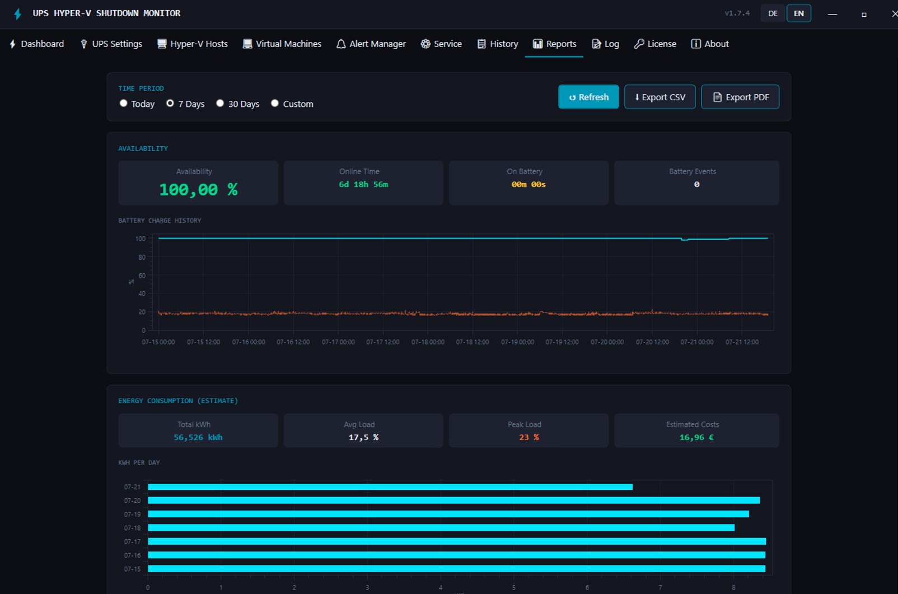

# UPS Hyper-V Shutdown Monitor

**UPS Hyper-V Shutdown Monitor is Windows software that monitors a UPS via SNMP or NUT and, during a power outage, gracefully shuts down Microsoft Hyper-V hosts and all their virtual machines in a defined order — before the UPS battery runs out. It runs unattended as a Windows Service. No cloud, no agents on the hosts, all data stays on your server.**

🔗 **Website, full feature list and pricing: [upsmonitor.de/en](https://upsmonitor.de/en/)** · [Deutsch](https://upsmonitor.de/)
**👉 [Download the latest installer](../../releases/latest)** · 30-day free trial, every feature unlocked

---

## What is this repository?

This repository hosts **only the release binaries** of UPS Hyper-V Shutdown Monitor; the application's source code is closed. It is the trusted public download source (with SHA-256 checksums) and the update feed of the application's built-in updater.

## What it does

- **UPS monitoring via SNMP v1/v2c/v3 and NUT** — native support for **APC, Eaton, Socomec, Vertiv/Liebert, Huawei and CyberPower**, RFC 1628 (UPS-MIB) as universal fallback, and NUT (Network UPS Tools) for hundreds of further models. Reads battery charge, runtime, load, input voltage, temperature and battery health.
- **Orderly emergency shutdown** — per host, every VM is shut down gracefully (with timeout and forced fallback) or saved (Save-VM), then the Hyper-V host itself; physical servers without Hyper-V and the local machine can be included. Configurable order and an abort window if mains power returns.
- **No agents on the Hyper-V hosts** — everything runs over WinRM / PowerShell Remoting (HTTP/HTTPS, Negotiate/Kerberos/Basic). Unlimited hosts and VMs in every edition.
- **Live migration instead of shutdown** (Pro) — if only one site loses power, running VMs are moved to a healthy partner node.
- **Multiple UPS units and UPS redundancy** (Pro) — each UPS protects only its assigned hosts; a second feed per host prevents unnecessary shutdowns. Individual runtime thresholds per server.
- **Alerting** — e-mail via SMTP or Microsoft 365 and SNMP traps (all editions); Microsoft Teams, SMS and webhooks for Slack, Discord, n8n or Zapier (Pro).
- **Reports** (Pro) — availability and uptime, battery health trend, energy and cost estimate, monthly manager report as PDF by e-mail, CSV/PDF export.
- **Remote web interface for Server Core** (Enterprise) — full operation in the browser via HTTPS, additional users with admin/read-only roles and an audit log.
- **UPS monitoring without shutdown** (Enterprise) — monitoring-only mode per UPS or globally, warning thresholds for battery, load, temperature and input voltage, scheduled UPS self-tests.
- **Monitoring integration** (Enterprise) — health endpoint for JSON, Prometheus and PRTG; fixed Windows event IDs for SIEM (Microsoft Sentinel, Splunk).
- **Safe to test** — readiness check, shutdown dry-run with estimated duration, test mode and a shutdown history.
- **German and English** user interface, dark and light theme.

<p align="center">
  
  
</p>

More screenshots: **[upsmonitor.de/en/features.html](https://upsmonitor.de/en/features.html)**

## Editions and pricing

One-time purchase (perpetual license), no subscription. Current prices and the full comparison: **[upsmonitor.de/en/#editions](https://upsmonitor.de/en/#editions)** · machine-readable: [pricing.md](https://upsmonitor.de/pricing.md)

| Edition | Price | Adds |
| --- | --- | --- |
| Standard | €139 | SNMP/NUT monitoring, unlimited Hyper-V hosts and VMs, physical servers, e-mail and SNMP trap alerts, Windows Service, auto-updater |
| Pro | €199 | Multiple UPS units, UPS redundancy, live migration, Teams/SMS/webhook alerts, reports, tamper protection |
| Enterprise | €349 | Remote web interface for Server Core, users and audit log, monitoring integration, monitoring-only mode, warning thresholds, UPS self-test |

Every edition starts with a **30-day free trial** of all features — no registration, no credit card. Licenses are sold to businesses only; checkout and invoicing are handled by Polar (Merchant of Record).

## System requirements

- Windows 10/11 or Windows Server 2019/2022/2025 (x64)
- Self-contained installer — .NET 10 included, nothing to install beforehand
- Network access to the UPS (SNMP management card or NUT server) and to the Hyper-V hosts (WinRM, port 5985 or 5986)

## Your data stays with you

Measurements, reports, configuration, credentials and logs are stored only on your own server — no cloud, no vendor account, no telemetry. Outbound connections are limited to the license check (Polar), the update check against this repository, and the alert channels you configure yourself. Details: [upsmonitor.de/en/privacy.html](https://upsmonitor.de/en/privacy.html)

## Verifying a download

Every release lists the installer's SHA-256 checksum in its notes. On Windows:

```powershell
Get-FileHash UpsHyperVShutdown-Setup-X.Y.Z.exe -Algorithm SHA256
```

Compare the result with the checksum on the [latest release](../../releases/latest) or on [upsmonitor.de](https://upsmonitor.de/en/#download).

## How updates work

The built-in updater reads `version.json` from the latest release of this repository, downloads the setup package, verifies its SHA-256 and installs it silently; the Windows Service and the app restart automatically. You can also download and run a new installer manually — settings and license are kept. Security updates are free of charge.

## Guides

- [Hyper-V failover cluster and power outages](https://upsmonitor.de/en/hyperv-cluster-power-outage.html) — quorum, CSV and live migration during a UPS outage
- [Domain controllers and power outages](https://upsmonitor.de/en/domain-controller-power-outage.html) — the USN rollback myth
- [SQL Server and Exchange on Hyper-V](https://upsmonitor.de/en/sql-exchange-hyperv-power-outage.html) — crash consistency and write caches
- [PowerChute alternative for Hyper-V](https://upsmonitor.de/en/powerchute-alternative-hyperv.html) — compared with APC PowerChute Network Shutdown
- [Calculating UPS runtime](https://upsmonitor.de/en/calculating-ups-runtime.html) — why datasheet runtimes rarely hold
- [Monitoring UPS units from multiple vendors](https://upsmonitor.de/en/multiple-ups-vendors.html) — SNMP and NUT as the common denominator

## Support, security and contact

- Setup guide: [English](https://upsmonitor.de/en/setup-guide.html) · [Deutsch](https://upsmonitor.de/einrichtung.html)
- What's new: [version history](https://upsmonitor.de/en/whats-new.html)
- Support: mail@247-it.com
- Security vulnerabilities: please report privately as described at [upsmonitor.de/en/security.html](https://upsmonitor.de/en/security.html) — not as a public issue

---

## Kurz auf Deutsch

Der **USV Hyper-V Shutdown Monitor** überwacht USVs per SNMP v1/v2c/v3 oder NUT und fährt bei Stromausfall Hyper-V Hosts samt allen virtuellen Maschinen geordnet herunter, bevor der Akku leer ist. Er läuft als Windows-Dienst, braucht keine Agenten auf den Hosts und speichert alle Daten ausschließlich lokal. Einmallizenz ohne Abo (Standard 139 €, Pro 199 €, Enterprise 349 €), 30 Tage kostenlos testen. Mehr auf **[upsmonitor.de](https://upsmonitor.de/)** — [Einrichtungsanleitung](https://upsmonitor.de/einrichtung.html) · [Ratgeber](https://upsmonitor.de/ratgeber.html)

---

*UPS Hyper-V Shutdown Monitor is developed and published by [247-IT](https://www.247-it.com), Germany. This repository intentionally contains no application source code.*
