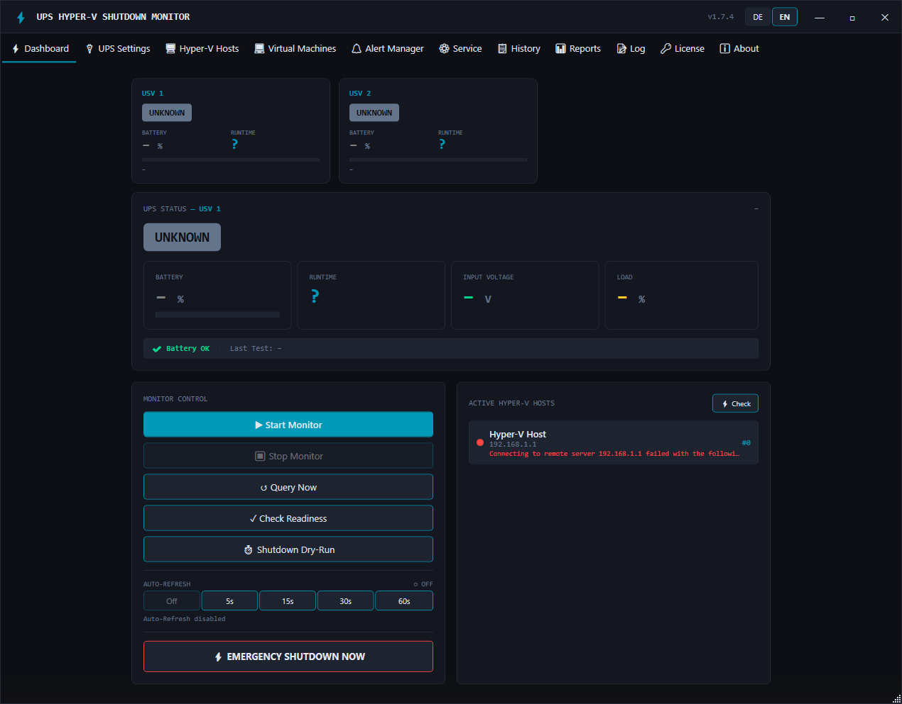

# UPS Hyper-V Shutdown Monitor

**UPS monitoring and orderly emergency shutdown for Hyper-V environments — SNMP/NUT monitoring, graceful VM + host shutdown, alerting and reports in one Windows app with a background service. No cloud, all data stays local.**

🔗 **Website & full feature list: [upsmonitor.de](https://upsmonitor.de)** (Deutsch · [English](https://upsmonitor.de/en/))

---

## What is this repository?

This repo hosts **only the release binaries** for UPS Hyper-V Shutdown Monitor — the
application's source code is closed/private. It exists to give users a trusted,
publicly verifiable download source (with SHA-256 checksums) and serves as the
update feed for the application's built-in updater.

**👉 [Download the latest installer](../../releases/latest)**

## What it does

- **UPS monitoring via SNMP v1/v2c/v3 and NUT** — APC PowerNet, Eaton (xUPS + MGE) and generic RFC 1628 MIBs; battery charge, runtime, load, input voltage, temperature and self-test status
- **Orderly emergency shutdown** — shuts down all VMs per host (graceful with timeout + forced fallback, or Save-VM/suspend), then the Hyper-V hosts, optionally the local machine — with configurable order, per-VM rules and an abort window if mains power returns
- **Multiple Hyper-V hosts** via WinRM/PowerShell remoting (HTTP/HTTPS, Negotiate/Kerberos/Basic)
- **Multiple UPS devices** (Pro) — each UPS shuts down only its assigned hosts
- **Windows service** for unattended operation + WPF dashboard GUI (German/English)
- **Alerting** — SMTP e-mail, Microsoft 365 (app-only and device-code flow), Microsoft Teams (Pro), SMS via seven.io (Pro), SNMP traps: on power loss, power restored, low battery, unreachable UPS, battery health, bypass and shutdown
- **Reports** (Pro) — availability/uptime analysis, energy estimation with cost, automatic monthly manager report as PDF via e-mail
- **Diagnostics** — one-click readiness check, shutdown dry-run with time estimate, shutdown history
- **Auto-updates** — the app checks this repository's releases; every downloaded installer is verified via SHA-256 before it runs
- **30-day fully functional free trial**, then a perpetual one-time license (Standard €129 / Pro €189) via Polar.sh — no subscription, no monthly costs

<p align="center"></p>

See more screenshots and the full feature breakdown at **[upsmonitor.de](https://upsmonitor.de)**.

## System requirements

- Windows 10/11 or Windows Server 2019/2022/2025 (x64)
- Self-contained — no separate .NET runtime required
- Network access to the UPS (SNMP management card or NUT server) and to the Hyper-V hosts (WinRM)

## Verifying a download

Every release lists the installer's SHA-256 checksum in its notes. On Windows, verify with:

```powershell
Get-FileHash UpsHyperVShutdown-Setup-X.Y.Z.exe -Algorithm SHA256
```

Compare the output against the checksum shown on the [latest release](../../releases/latest)
or on [upsmonitor.de](https://upsmonitor.de).

## How updates work

The built-in updater fetches `version.json` from the latest release of this repository,
downloads the setup package, verifies its SHA-256 and runs it silently — the Windows
service and the GUI restart automatically. Alternatively, simply download and run the
new installer manually; settings and license are preserved.

## Support & contact

- Website: https://upsmonitor.de
- Setup guide: https://upsmonitor.de/einrichtung.html ([English](https://upsmonitor.de/en/setup-guide.html))
- Support: mail@247-it.de

---

*UPS Hyper-V Shutdown Monitor is developed and published by 247-IT. This repository intentionally contains no application source code.*
